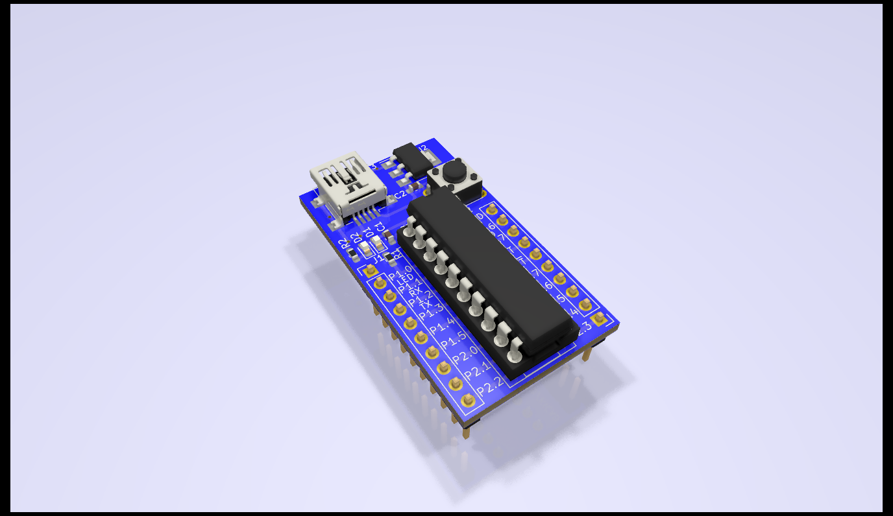

# 1-Hour-Board

##### Board designed in KiCAD for use in 1-Hour-Board KiCAD course
------

  
Features
* Socket for MSP430G2xxx microcontrollers
* Power LED, status LED, and reset button
* Power in from USB Mini-B connector
