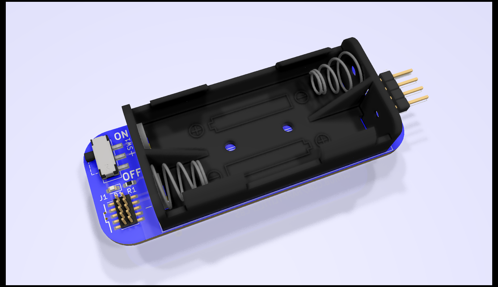

# Debug Adapter

##### Adapter to convert from J-Link EDU Mini to ARM 4-Pin connector (think Blue Pill)
------

  
Features
* 10-pin J-Link EDU Mini to 4-pin ARM, silk labeled
* Fits 2x AAA batteries to power DUT
* Switch and indicator LED for DUT power
