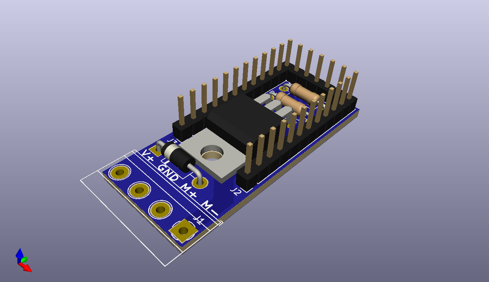

# Mini Pod Platform

##### Open source electronics platform using STM32 Microcontrollers
------
## Motor Pod Mini 
  
Add-on for STM32Pod Mini
* Can power one 12V DC motor in one direction 
* Terminal blocks for easy attachement of leads
* External interface to allow for other micros
* Serial connection to control remotely
