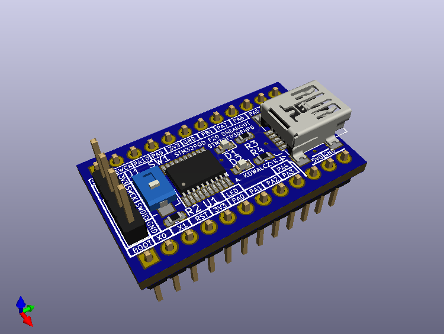

# STM Pod Platform  

##### Open source electronics platform using STM32 Microcontrollers
------
## STMPod F20  
  
Uses STM32F030F4P6 Microcontroller  
* Power over Mini-USB  
* User and Power LED  
* Reset button
* NOTE: Silk for SWCLK & SWDIO is switched, you'll need to reverse those lines when programming. I will update this when fixed
