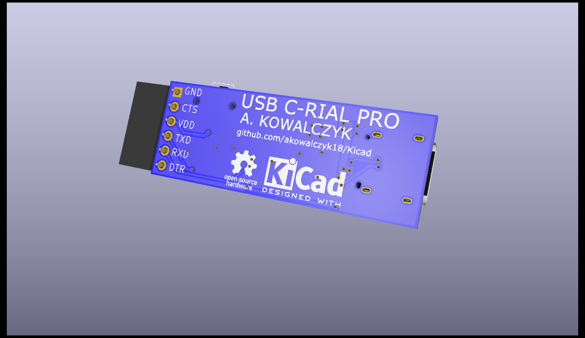
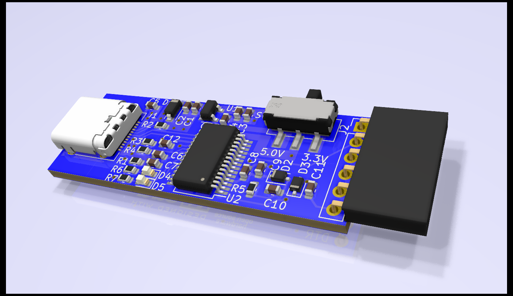

# USB C-RIAL PRO 

##### USB to UART adapter using USB Type C Receptacle
------

  
Uses Cypress CY7C65213 USB to UART Converter
* TX and RX LEDs
* Extra pins broken out to program Arduino compatible boards

      